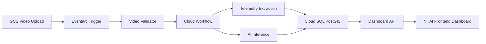

# NHAI Dashcam Analytics Service (DAS)

This repository contains the application and infrastructure code for the NHAI Dashcam Analytics Service (DAS), designed for high-performance highway infrastructure inspection and automated defect detection.

---

## 🗺️ Architecture Overview

The system is deployed under a **Single Unified GCP Project** (`peppy-castle-276303`) utilizing resource-level namespace prefixing (`nhai-das-dev-***`) for clean environment isolation. The pipeline processes raw highway dashcam footage to detect road infrastructure anomalies (e.g. potholes, missing signage, road cracks) using a serverless event-driven architecture.

### Core Processing Pipeline:
1. **Upload**: Dashcam footage is uploaded to `gs://nhai-das-dev-raw-video/`.
2. **Validation**: An Eventarc trigger invokes the `video-validator` service. Corrupted clips are quarantined; healthy videos trigger the Cloud Workflow.
3. **Extraction & Inference**: The Workflow runs `telemetry-extractor` (to extract GPS EXIF headers) and `ai-inference` (YOLOv8 + CV road surface analysis) in parallel.
4. **Ingestion**: Results are ingested into a Cloud SQL PostgreSQL PostGIS spatial database (`nhaidb`).
5. **Dashboard & Reporting**: NHAI operators view defects live on an interactive Leaflet GIS dark map and generate compliance-ready PDF reports.

### Pipeline Architecture



---

## 📂 Project Structure

*   `services/` — Serverless microservices (Cloud Run):
    *   [video-validator/](file:///c:/Users/MSI-1/Desktop/Dashcam/services/video-validator/) — Ingestion gatekeeper & codec analyzer.
    *   [telemetry-extractor/](file:///c:/Users/MSI-1/Desktop/Dashcam/services/telemetry-extractor/) — GPS & EXIF stream parser.
    *   [ai-inference/](file:///c:/Users/MSI-1/Desktop/Dashcam/services/ai-inference/) — YOLOv8 deep learning + OpenCV road region processor.
    *   [dashboard-api/](file:///c:/Users/MSI-1/Desktop/Dashcam/services/dashboard-api/) — PostGIS backend controller.
    *   [report-generator/](file:///c:/Users/MSI-1/Desktop/Dashcam/services/report-generator/) — PDF compiler with dynamic chainage & GCS image embeds.
    *   [dashboard-frontend/](file:///c:/Users/MSI-1/Desktop/Dashcam/services/dashboard-frontend/) — Vite + React operations map dashboard.
*   `terraform/` — Infrastructure as Code (networking, storage, database, observability).
*   `scripts/` — End-to-end testing and database initialization utilities.
*   `Sample/` — High-fidelity highway dashcam video assets.

## 🔑 Credentials & Access

### Operations Map Dashboard Accounts
To log in to the Vite frontend dashboard:

| Role | Username | Password | Notes |
| :--- | :--- | :--- | :--- |
| **Administrator** | `administrator` | `Admin@123` | Full access, unlimited uploads |
| **RO User** | `ro` | `Ro@123` | Limited to 3 uploads per day |

### Local Database Fallbacks
Default credentials used by the local microservices and initialization scripts:
- **DB User**: `postgres`
- **DB Password**: `postgres`
- **DB Name**: `nhaidb`
- **DB Host**: `localhost`

---

## ⚡ Quick Start (Local Development)

### 1. Database Schema Initialization
Set the required environment variables and run:
```bash
python scripts/init_db.py
python scripts/alter_table.py
```

### 2. Running Frontend Locally
To launch the Vite frontend dashboard:
```bash
cd services/dashboard-frontend
npm install
npm run dev
```

### 3. Pipeline Ingestion Testing
Run the automated end-to-end integration script to verify uploads:
```bash
python scripts/e2e_test.py
```

---

## Technology Stack & Implementation Rationale

This project is built as a cloud-native, event-driven dashcam analytics pipeline for NHAI road-condition monitoring. The stack was selected to support video ingestion, AI inference, geospatial storage, reporting, observability, and future multi-model detection.

### Backend Services

**FastAPI + Python**
- Python was selected because it has the strongest ecosystem for AI/ML, computer vision, video processing, and geospatial workflows.
- FastAPI keeps each Cloud Run service lightweight and easy to deploy.
- Implemented services include `video-validator`, `frame-extractor`, `telemetry-extractor`, `ai-inference`, `data-processor`, `dashboard-api`, and `report-generator`.

### AI / Computer Vision

**Ultralytics YOLO + OpenCV**
- YOLO is used for frame-level anomaly detection.
- OpenCV is used for deterministic road-surface checks such as pothole/crack/rutting-style visual analysis.
- The inference service now supports multiple model weights through `YOLO_MODEL_NAMES`.
- Each detection stores model/source metadata such as `model_name`, `model_family`, `model_group`, `method`, confidence, frame id, and annotation data.

### NHAI TOR Taxonomy

A full NHAI TOR anomaly taxonomy has been added so the software contract can support all required anomaly categories:
- pavement
- shoulders
- kerb and median
- plantation
- drainage
- footpath
- crash barriers
- signboards and overhead structures
- road furniture
- pavement markings
- bus bay and truck lay-bye
- highway lighting

Actual accuracy for every anomaly depends on training and deploying the correct model weights.

### Cloud Platform

**Google Cloud Platform**
- Cloud Run hosts the microservices.
- Cloud Storage stores raw videos, validated videos, processed frames/metadata, and quarantined files.
- Eventarc triggers ingestion when videos are uploaded.
- Cloud Workflows orchestrates frame extraction, telemetry extraction, AI inference, and database ingestion.
- Cloud SQL PostgreSQL with PostGIS stores geospatial detection results.
- Cloud Monitoring and Logging handle operational alerts.
- Secret Manager stores database credentials.

### Database

**PostgreSQL + PostGIS**
- Picked because detections are spatial records with latitude/longitude.
- PostGIS supports future map queries, chainage logic, corridor filtering, and geospatial reporting.
- Detection metadata is stored as JSONB so model details and annotations can evolve without frequent schema changes.

### Frontend

**React + Vite**
- React provides a responsive operator dashboard.
- Vite keeps local development and builds fast.
- The frontend displays upload state, pipeline progress, road defect tables, model/category metadata, evidence images, and report exports.

### Infrastructure & Deployment

**Terraform**
- Used to define cloud resources repeatably: networking, buckets, database, IAM, monitoring, billing, and messaging resources.

**Cloud Build**
- Builds Docker images, deploys Cloud Run services, deploys the workflow, and ensures the upload trigger exists.

### Reporting

**ReportLab**
- Used to generate NHAI-style PDF reports from stored detection records.
- Reports include defect type, category, coordinates, model/source, and evidence images where available.

### Reliability Implemented

- Invalid video quarantine
- Cloud Workflow retries
- Stage-level `pipeline_events`
- `PIPELINE_FAILURE` logging
- Email alert hook through Cloud Monitoring
- Pipeline timeout/stuck detection
- Dashboard/API status visibility

### Why This Stack Fits

This architecture lets the system begin with a simple AI model and grow into a multi-model TOR-compliant detection platform. Each major responsibility is isolated into its own service, so validation, frame extraction, inference, storage, reporting, and monitoring can improve independently.
